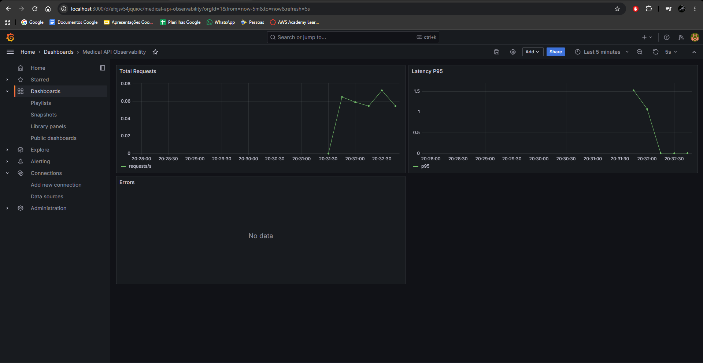

# Medical Text Classifier — Tech Challenge Fase 3

Projeto de Machine Learning para **classificação de abstracts médicos**, utilizando o dataset **Medical Abstracts TC Corpus**.

A solução contempla preparação dos dados, treinamento, avaliação, API, otimização de inferência, Docker, observabilidade, Airflow e CI/CD.

---

## 1. Estratégia de Deploy em Nuvem

Para este cenário, a estratégia proposta utiliza **AWS**, separando treinamento e inferência.

### Treinamento — Batch

O treinamento é um processo batch, pois não precisa responder imediatamente ao usuário.

Em cloud, uma possível arquitetura seria:

* **Amazon S3:** armazenamento dos datasets e modelos;
* **Amazon MWAA / Airflow:** orquestração do treinamento;
* **Amazon ECR:** armazenamento da imagem Docker;
* execução do treinamento sob demanda ou de forma agendada.

### Inferência — Real-time

O endpoint `/predict` precisa responder imediatamente às requisições, portanto foi projetado como **real-time**.

Uma possível implantação seria:

* **FastAPI + ONNX Runtime** em container;
* **Amazon ECS/Fargate** para execução;
* **Application Load Balancer** para distribuição das requisições;
* **CloudWatch / Prometheus / Grafana** para observabilidade.

Essa separação permite escalar treinamento e inferência independentemente e utilizar recursos computacionais somente quando necessários.

---

## 2. Dataset e Preparação

Foi utilizado o **Medical Abstracts TC Corpus**.

Arquivos:

```text
medical_tc_train.csv
medical_tc_test.csv
medical_tc_labels.csv
```

Treino e teste possuem:

```text
condition_label,medical_abstract
```

O arquivo de labels possui:

```text
condition_label,condition_name
```

Para reduzir o consumo de memória, o treinamento processa o CSV em **chunks de 5.000 registros**.

| Conjunto    | Registros |
| ----------- | --------: |
| Treinamento |    11.550 |
| Teste       |     2.888 |

---

## 3. Modelo e Treinamento

O modelo utiliza:

* `HashingVectorizer` para vetorização dos textos;
* `SGDClassifier` com `loss="log_loss"`;
* `partial_fit` para treinamento incremental.

Treinamento:

```bash
poetry run python scripts/train.py
```

Modelo gerado:

```text
models/model.joblib
```

---

## 4. Avaliação

Execução:

```bash
poetry run python scripts/evaluate.py
```

### Resultados

| Métrica         |  Resultado |
| --------------- | ---------: |
| Accuracy        | **56,02%** |
| Precision Macro | **54,33%** |
| Recall Macro    | **54,21%** |
| F1 Macro        | **52,89%** |

Foram avaliados **2.888 registros** do conjunto de teste.

Os resultados são armazenados em:

```text
benchmarks/evaluation.json
```

---

## 5. API REST

O modelo foi disponibilizado através de uma API utilizando **FastAPI**.

Endpoints:

| Endpoint        | Descrição                  |
| --------------- | -------------------------- |
| `GET /health`   | Verifica a disponibilidade |
| `POST /predict` | Classifica um abstract     |
| `GET /metrics`  | Expõe métricas Prometheus  |

Execução:

```bash
poetry run uvicorn app.main:app --reload
```

Swagger:

```text
http://localhost:8000/docs
```

A versão final da API utiliza **ONNX Runtime** para realizar a inferência.

---

## 6. Otimização de Inferência

O `SGDClassifier` foi convertido para **ONNX** e executado com ONNX Runtime.

Conversão:

```bash
poetry run python scripts/optimize.py
```

Benchmark:

```bash
poetry run python scripts/benchmark_optimized.py
```

O teste comparou baseline e ONNX utilizando os mesmos **200 abstracts**.

### Resultados

| Métrica | Baseline |         ONNX |   Melhoria |
| ------- | -------: | -----------: | ---------: |
| Média   | 3,982 ms | **1,614 ms** | **59,47%** |
| Mediana | 3,899 ms | **1,571 ms** | **59,71%** |
| P95     | 4,845 ms | **2,066 ms** | **57,37%** |
| P99     | 5,078 ms | **2,209 ms** | **56,50%** |

Também foi obtido:

**Prediction Agreement: 100%**

Nas 200 amostras avaliadas, ONNX e o modelo baseline produziram as mesmas classificações.

---

## 7. Docker e Observabilidade

A aplicação foi conteinerizada utilizando **Docker e Docker Compose**.

Execução:

```bash
docker compose up --build
```

Serviços:

| Serviço    | Endereço         |
| ---------- | ---------------- |
| FastAPI    | `localhost:8000` |
| Prometheus | `localhost:9090` |
| Grafana    | `localhost:3000` |

As principais métricas monitoradas são:

* `api_requests_total`
* `api_request_latency_seconds`
* `api_errors_total`

O Prometheus coleta as métricas da API e o Grafana é utilizado para visualização.

---

## 8. Orquestração com Airflow

Foi criada a DAG:

```text
medical_training_pipeline
```

Ela possui duas etapas principais:

1. `validate_data`
2. `train_and_save_model`

A DAG valida o dataset, executa o treinamento incremental e salva o modelo.

Execução:

```bash
docker compose -f docker-compose-airflow.yml up --build
```

A DAG foi **executada e validada com sucesso**.

---

## 9. CI/CD com GitHub Actions

O projeto possui integração contínua através de:

```text
.github/workflows/ci.yml
```

A pipeline executa:

1. Ruff;
2. Pytest;
3. Docker Build.

O workflow foi **executado e validado com sucesso no GitHub Actions**.

---

## 10. Testes e Qualidade

Lint:

```bash
poetry run ruff check .
```

Testes:

```bash
poetry run pytest
```

Os testes verificam componentes da API, dados e pipelines de Machine Learning.

---

## 11. Principais Resultados

| Item                      |            Resultado |
| ------------------------- | -------------------: |
| Treinamento               | **11.550 registros** |
| Teste                     |  **2.888 registros** |
| Accuracy                  |           **56,02%** |
| F1 Macro                  |           **52,89%** |
| Latência baseline         |         **3,982 ms** |
| Latência ONNX             |         **1,614 ms** |
| Redução média de latência |           **59,47%** |
| Prediction Agreement      |             **100%** |
| FastAPI                   |                    ✅ |
| Docker                    |                    ✅ |
| Prometheus / Grafana      |                    ✅ |
| Airflow                   |                    ✅ |
| GitHub Actions            |                    ✅ |

---

## 12. Como Executar

Instalar dependências:

```bash
poetry install
```

Treinar:

```bash
poetry run python scripts/train.py
```

Avaliar:

```bash
poetry run python scripts/evaluate.py
```

Converter para ONNX:

```bash
poetry run python scripts/optimize.py
```

Executar benchmark:

```bash
poetry run python scripts/benchmark_optimized.py
```

Executar testes:

```bash
poetry run pytest
```

Subir API e monitoramento:

```bash
docker compose up --build
```

Subir Airflow:

```bash
docker compose -f docker-compose-airflow.yml up --build
```

### Dashboard Grafana

O dashboard apresenta o monitoramento da API, incluindo total de requisições, latência e erros.



---

## 13. Conclusão

O projeto implementa um pipeline completo de Machine Learning para classificação de abstracts médicos, incluindo treinamento incremental, API REST, otimização, observabilidade, orquestração e integração contínua.

O principal resultado da otimização foi a redução da latência média de **3,982 ms para 1,614 ms**, equivalente a uma melhoria de **59,47%**, mantendo **100% de concordância das predições nas 200 amostras utilizadas no benchmark**.
